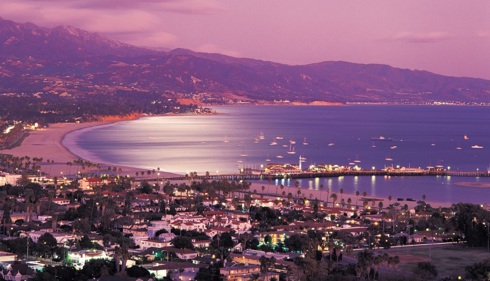
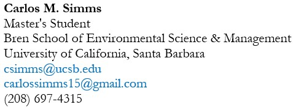

## Biography

First-generation alumnus from The University of Idaho and a former Ronald E. McNair Achievement scholar. Academic accreditation includes a Bachelor of Science in Environmental Science and an Academic Certificate in Climate Change. Pursuing a Master of Science in Environmental Science and Management at The University of California Santa Barbara; specializing in energy and climate studies. Aspire to work with solar energy, holistically aspiring for an opportunity that paves the way for a future with renewable energy, climate responsibility, and Global South equity.

## Contact

