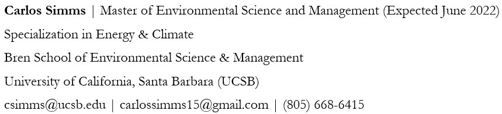

## Biography

Former McNair Achievement Scholar at the University of Idaho. Current Environmental Science & Management Graduate Fellow at the University of California, Santa Barbara. Aspiring to work in solar energy markets and on electric vehicle charging infrastructure projects. Searching for an opportunity that paves the way for a future with renewable energy, climate responsibility, and environmental equity.

## Contact Information

